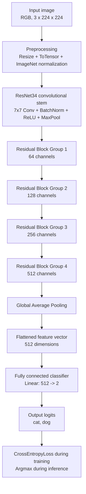
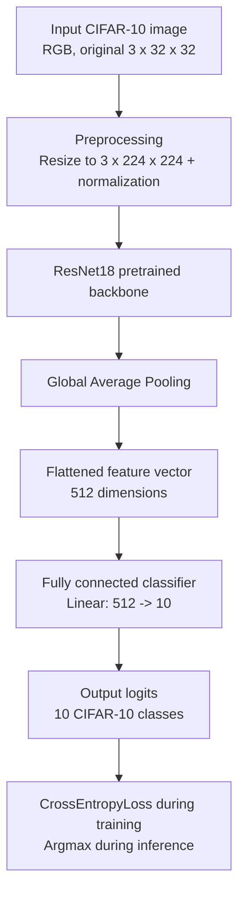

# Model Architecture Diagrams

## Dogs vs Cats Final Model: ResNet34

```mermaid
flowchart TD
    A["Input image<br/>RGB, 3 x 224 x 224"] --> B["Preprocessing<br/>Resize + ToTensor + ImageNet normalization"]
    B --> C["ResNet34 convolutional stem<br/>7x7 Conv + BatchNorm + ReLU + MaxPool"]
    C --> D["Residual Block Group 1<br/>64 channels"]
    D --> E["Residual Block Group 2<br/>128 channels"]
    E --> F["Residual Block Group 3<br/>256 channels"]
    F --> G["Residual Block Group 4<br/>512 channels"]
    G --> H["Global Average Pooling"]
    H --> I["Flattened feature vector<br/>512 dimensions"]
    I --> J["Fully connected classifier<br/>Linear: 512 -> 2"]
    J --> K["Output logits<br/>cat, dog"]
    K --> L["CrossEntropyLoss during training<br/>Argmax during inference"]
```

## CIFAR-10 Extension Model: ResNet18

```mermaid
flowchart TD
    A["Input CIFAR-10 image<br/>RGB, original 3 x 32 x 32"] --> B["Preprocessing<br/>Resize to 3 x 224 x 224 + normalization"]
    B --> C["ResNet18 pretrained backbone"]
    C --> D["Global Average Pooling"]
    D --> E["Flattened feature vector<br/>512 dimensions"]
    E --> F["Fully connected classifier<br/>Linear: 512 -> 10"]
    F --> G["Output logits<br/>10 CIFAR-10 classes"]
    G --> H["CrossEntropyLoss during training<br/>Argmax during inference"]
```

